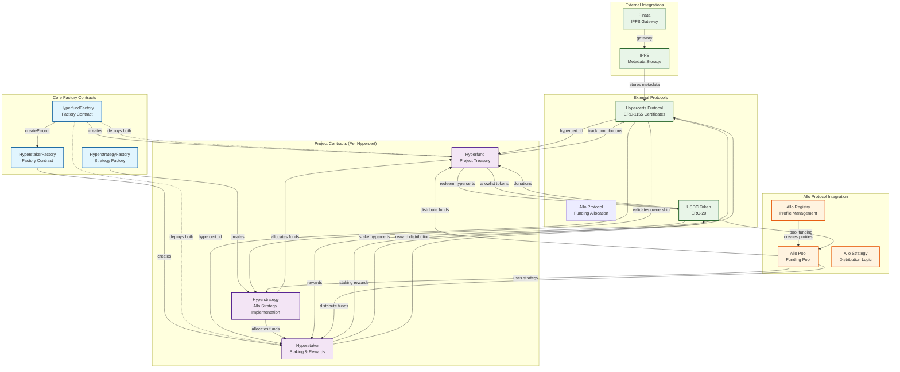

# Hyperstaker Smart Contract Architecture

## Contract Descriptions

### Factory Contracts
- **HyperfundFactory**: Deploys Hyperfund and Hyperstaker contracts for each project
- **HyperstakerFactory**: Creates staking contracts linked to specific hypercerts  
- **HyperstrategyFactory**: Deploys Allo strategy contracts for funding distribution

### Core Project Contracts
- **Hyperfund**: Project treasury that holds donations and allows hypercert redemption
- **Hyperstaker**: Staking contract where users can stake hypercerts for rewards
- **Hyperstrategy**: Allo strategy implementation for fair fund distribution

### Key Functions by Contract

#### Hyperfund
- `donate()`: Accept USDC donations
- `allowlistToken()`: Approve new tokens for donations
- `redeem()`: Allow hypercert holders to claim funds
- `nonfinancialContribution()`: Track non-monetary contributions

#### Hyperstaker  
- `stake()`: Stake hypercert for rewards
- `unstake()`: Remove hypercert from staking
- `setReward()`: Distribute rewards to stakers

#### Hyperstrategy
- `allocate()`: Distribute pool funds between Hyperfund and Hyperstaker
- `registerRecipient()`: Register projects as funding recipients
- `distribute()`: Execute fund distribution

### Integration Points
1. **Hypercerts Protocol**: Provides proof-of-impact certificates (ERC-1155)
2. **Allo Protocol**: Handles funding pools and allocation strategies
3. **USDC**: Primary currency for donations and rewards
4. **IPFS/Pinata**: Decentralized metadata storage

### Deployment Networks
- **Sepolia Testnet** (11155111): Development and testing
- **Celo Mainnet** (42220): Production deployment